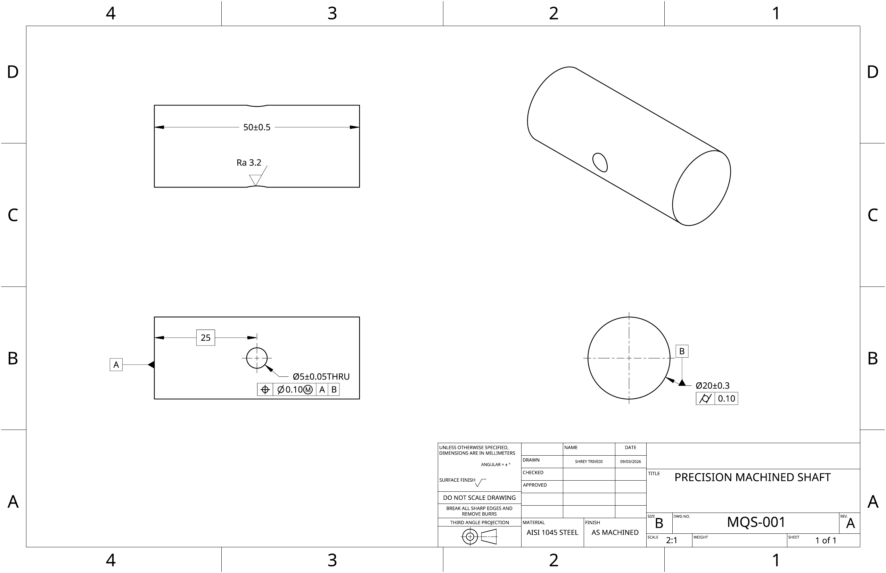

# Manufacturing Process Capability & Defect Reduction

A quality-engineering portfolio study: **measure the system, locate the variation, test an intervention, and define the controls.**

The main study follows 20,000 **simulated** machined parts through Gage R&R, process monitoring, dimensional performance, root-cause analysis and a modeled machine-centering change. A second study uses **real, anonymized SECOM data** to explore missingness, monitoring signals and failure classification.

**No real production improvement is claimed.** The machining process and its root cause are authored into the generator. The SECOM results are exploratory, not independently validated predictive performance.

[Machining notebook](quality_analysis.ipynb) · [SECOM notebook](secom_analysis.ipynb) · [Excel dashboard](dashboard/quality_dashboard.xlsx) · [Drawing PDF](reports/precision_machined_shaft_drawing.pdf)

## Manufacturing dashboard

[](dashboard/quality_dashboard_preview.png)

The image is a presentation companion generated from the same CSV as the [editable Excel dashboard](dashboard/quality_dashboard.xlsx), not an Excel screenshot. The workbook includes native charts, formula-linked summary tiles, a heatmap and supporting tables. [Metric values](dashboard/metrics.json) and the [preview generator](scripts/build_dashboard_preview.py) make the image reproducible.

## What the study found

| Question | Evidence | Interpretation |
|---|---|---|
| Can the gage distinguish the sampled parts? | **9.13% GRR**, **15** distinct categories | Acceptable under the study criteria; the sampled part range matters. |
| Where is the dimensional problem? | **M3 Ppk = 0.73**; other machines **2.93–2.99** | The modeled M3 offset dominates diameter differences. |
| What causes most recorded failures? | **407 surface-finish defects**, **38.2%** of failures | Dimensional centering alone cannot remove the largest defect category. |
| Does modeled centering help? | Overall Ppk **0.79 → 2.87**; FPY **94.7% → 95.1%** | Dimensional performance improves substantially; total yield improves modestly. |

### 1. Simulated precision-machining line

Four CNC machines, three shifts and three suppliers produce 20,000 parts. A crossed measurement study adds **10 parts × 3 operators × 3 trials = 90 measurements**. True dimensions are retained separately from measured dimensions.

| Characteristic | Nominal | Lower limit | Upper limit |
|---|---:|---:|---:|
| Outside diameter | 20.00 mm | 19.70 mm | 20.30 mm |
| Length | 50.00 mm | 49.50 mm | 50.50 mm |

The [machining notebook](quality_analysis.ipynb) covers:

1. Crossed Gage R&R and variance components.
2. Baseline dimensional performance and inspection yield.
3. I-MR charts and Western Electric rule screening.
4. Defect Pareto and machine/shift/supplier stratification.
5. ANOVA, regression, temperature interactions and residual diagnostics.
6. Qualitative root-cause reasoning and a seeded M3-centering experiment.

Machine explains approximately **89.3% of diameter variation** in the one-factor ANOVA. The multiple regression has **R² ≈ 0.897**. M3 shows the strongest temperature association (**r ≈ 0.395**). These findings recover mechanisms intentionally embedded in the simulation; they do not discover a previously unknown physical cause.

| Measure | Baseline | Modeled M3 centering |
|---|---:|---:|
| Overall diameter Ppk | 0.79 | 2.87 |
| M3 diameter Ppk | 0.73 | 2.80 |
| First-pass yield | 94.675% | 95.050% |
| Defective parts per million | 53,250 | 49,500 |

Both scenarios use seed 42. Surface-finish, burr, taper and tool-mark mechanisms remain active after centering.

**How to interpret these numbers**

- **Pp/Ppk, not Cp/Cpk:** the calculations use overall sample standard deviation. The pooled baseline mixes machines and is not a demonstrated stable normal process. Treat these indices as descriptive comparisons, not process qualification. See [Minitab's definition](https://support.minitab.com/en-us/minitab/help-and-how-to/quality-and-process-improvement/capability-analysis/how-to/capability-sixpack/normal-capability-sixpack/interpret-the-results/all-statistics-and-graphs/overall-capability/).
- **GRR is percent study variation:** 9.13% is a standard-deviation ratio, equivalent to about 0.83% variance contribution. It depends on the selected part spread and does not establish accuracy, bias, linearity or per-machine adequacy.
- **FPY follows `Inspection_Result`:** the generator combines diameter failures and assigned categorical defects. It does not include a separate length-limit failure check. “Surface finish” is a simulated defect category, not measured Ra.
- **SPC is instructional:** dates are synthetic day-level assignments. Sorting by date and part ID does not establish actual within-day production order, and the pooled I-MR chart is not a deployment-ready control scheme.

The [control plan](reports/control_plan.md) defines proposed CTQs, methods, sampling and reaction plans. The [preliminary PFMEA](reports/pfmea.md) translates the modeled failure modes into proposed prevention and detection actions. Neither represents a production-approved control document.

### 2. Real-data companion: SECOM

The [SECOM notebook](secom_analysis.ipynb) examines **1,567 runs and 590 sensors**, including **104 failures**. It addresses a different problem: what can be learned when sensor identities, units and engineering specifications are unavailable?

- **41,951 missing values** (4.54%); every run has at least one missing sensor value.
- **116 constant sensors** and **6 additional near-constant sensors** identified.
- **54 possible step-change candidates** flagged for engineering review, not labeled as confirmed recalibrations.
- Six exploratory sensors examined with control charts and class-weighted logistic regression.

| Exploratory model result | Value |
|---|---:|
| Balanced accuracy | 0.7575 |
| ROC-AUC | 0.7708 |
| Average precision (PR summary) | 0.1978 |
| Failed test runs detected | 19 of 26 |
| Escape rate | 26.92% |
| False-reject rate | 21.58% |

**Validation limitation:** sensor selection used labels from the full dataset before the split. Although imputation and scaling are fit on training data only, feature-selection leakage means the scores above are not unbiased holdout estimates. A stronger next step is feature selection inside training folds plus a chronological holdout. Control limits are exploratory and do not establish a stable baseline. No engineering specifications are supplied, so capability indices are not applicable.

[Read the full SECOM data-integrity report](reports/secom_data_integrity.md).

### 3. Optional drawing extension

[](reports/precision_machined_shaft_drawing.pdf)

[Open the full-resolution drawing](reports/precision_machined_shaft_drawing.png) · [Download the vector PDF](reports/precision_machined_shaft_drawing.pdf)

The Onshape drawing connects the analysis to a physical-part specification exercise: shaft dimensions, a through cross-hole, datum references, positional and cylindricity controls, surface finish and a completed title block. It is **instructional, not released for manufacture**. The cross-hole/GD&T features are not measured in the production dataset. Assembly tolerance stacks and Monte Carlo assembly analysis are not included.

## Reproduce the work

Python 3.12 was used for release verification. From the repository root:

```bash
python -m venv .venv
source .venv/bin/activate
python -m pip install -r requirements.txt
jupyter lab
```

On Windows, activate with `.venv\Scripts\activate` instead. Open either notebook and run all cells in order. Data is already included, so regeneration is optional.

```bash
# Optional: overwrites the two synthetic CSV files using fixed seeds.
python generate_data.py

# Rebuild the static dashboard image and its metrics from manufacturing.csv.
python scripts/build_dashboard_preview.py
```

The Excel workbook is a curated baseline snapshot, not a live CSV connection. Regenerating data or the PNG does not automatically refresh its supporting tables. The notebook is the analytical source of truth.

## Repository guide

| File or folder | Purpose |
|---|---|
| [quality_analysis.ipynb](quality_analysis.ipynb) | Executed machining study, figures and modeled comparison |
| [secom_analysis.ipynb](secom_analysis.ipynb) | Executed real-data companion |
| [generate_data.py](generate_data.py) / [data/](data/) | Seeded simulation and synthetic observations |
| [dashboard/](dashboard/) | Excel dashboard, PNG companion and numeric summary |
| [reports/control_plan.md](reports/control_plan.md) | Proposed monitoring and reaction plan |
| [reports/pfmea.md](reports/pfmea.md) | Preliminary process FMEA |
| [reports/secom_data_integrity.md](reports/secom_data_integrity.md) | SECOM audit, model results and limitations |
| [reports/release_verification.md](reports/release_verification.md) | Execution, data and packaging checks |
| [PROJECT_OVERVIEW_AND_PROGRESS.md](PROJECT_OVERVIEW_AND_PROGRESS.md) | Original scope, completed work and optional next steps |

## Data attribution

SECOM: McCann, M. & Johnston, A. (2008). *SECOM* [Dataset]. UCI Machine Learning Repository. [DOI: 10.24432/C54305](https://doi.org/10.24432/C54305). The [UCI dataset page](https://archive.ics.uci.edu/dataset/179/secom) lists the data under [CC BY 4.0](https://creativecommons.org/licenses/by/4.0/). Raw SECOM files are retained without modification. Synthetic machining data is generated by this project.

---

**Author:** Shrey Trivedi · Quality engineering, process analysis and manufacturing systems
