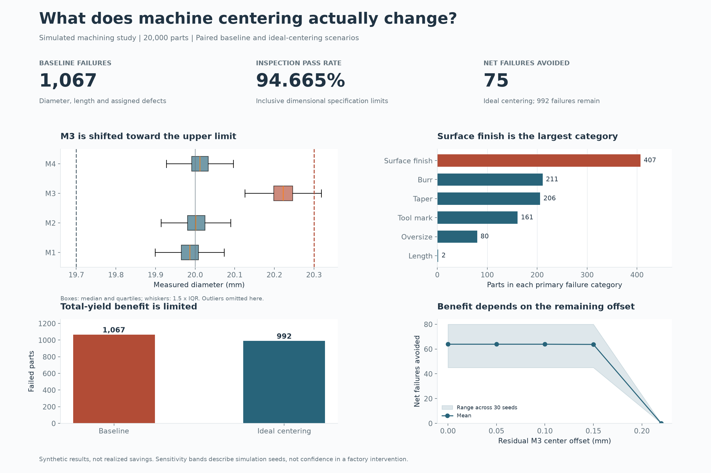

# Machine Centering and Inspection Yield

A simulated machining-quality study asking: **how much does correcting one machine's diameter offset help when most inspection failures have other causes?**

I generated 20,000 part records and a 90-reading crossed Gage R&R dataset, checked inspection consistency, compared machine-level variation, and evaluated paired centering scenarios. The causes are deliberately programmed into the simulation; this is a methods and decision-analysis project, not a claim of shop-floor discovery or realized savings.



[Read the analysis](reports/analysis.html) · [Executed notebook](quality_analysis.ipynb) · [Excel dashboard](dashboard/quality_dashboard.xlsx) · [Methods and assumptions](reports/methods.md)

## Main findings

| Result | Interpretation |
|---|---|
| **1,067 of 20,000 parts fail inspection** | Corrected logic includes diameter, length and assigned defects. Inspection pass rate is 94.665%. |
| **80 diameter failures, all on M3** | The model's +0.220 mm M3 offset moves diameter toward the upper specification. |
| **407 surface-finish labels** | The largest assigned category is not addressed by diameter centering. This is not measured Ra. |
| **75 net failures avoided in the paired seed-42 scenario** | Ideal centering removes diameter failures, but 992 total failures remain; pass rate becomes 95.040%. |

Across 30 additional paired seeds, ideal centering avoids **45–80 failures per 20,000 parts**, averaging **63.9**. The tested residual offsets show where this model's benefit weakens. These are simulation ranges, not confidence bounds on a factory intervention.

## What the project demonstrates

- **Inspection integrity:** found and corrected two length-out-of-spec parts previously labeled Pass, without changing their measurements.
- **Variation analysis:** machine distributions, conditional regression effects and residual supplier spread, without claiming that pooled data establish stable capability.
- **Measurement interpretation:** crossed ANOVA produces 9.13% study-variation GR&R and ndc 15 for the selected simulated parts. The broad part range prevents treating that result as blanket gage approval.
- **Decision limits:** an ideal adjustment improves diameter conformance but leaves most inspection losses. Proposed controls identify what a real confirmation study would need.

The [process/CTQ map](reports/process_and_characteristics.md), [proposed control plan](reports/control_plan.md) and [qualitative risk review](reports/pfmea.md) are design exercises, not implemented factory controls. No invented risk-priority scores or savings are used.

## Optional drawing exercise

The [Onshape shaft drawing](reports/precision_machined_shaft_drawing.pdf) shares the diameter and length specifications. Its cross-hole, geometric tolerances and Ra callout are **not evaluated by this dataset**. It is not released for manufacture.

## Reproduce

Use Python 3.12 and install `requirements.txt` in a virtual environment. From the project root:

```bash
python -m pip install -r requirements.txt
python -m unittest discover -s tests -v
python scripts/rebuild.py
```

The rebuild recalculates results, generates the presentation image, executes the notebook in a fresh kernel and exports readable HTML. Opening `reports/analysis.html` locally displays the report; GitHub may show the HTML source rather than render it.

To regenerate the synthetic source CSVs first, run `python generate_data.py`. Fixed seeds preserve reproducibility. The Excel builder requires the bundled Codex spreadsheet runtime (`@oai/artifact-tool` 2.8.59); it is not a public npm install. In that runtime, rebuild Excel after the Python analysis:

```bash
python scripts/rebuild_excel_local.py
```

The Excel file includes all prepared observations and formula-driven baseline summaries with native charts. It is rebuilt from the CSV, not connected live to it. Scenario and GR&R results refresh during rebuild; editing measurement cells in Excel does not rerun the inspection model. Without the bundled runtime, the complete Python analysis, HTML report and dashboard PNG can still be rebuilt; the supplied Excel file can be opened normally.

[Verification and changes](reports/release_verification.md) · [Interview explanation](reports/interview_notes.md)

**Shrey Trivedi** — simulation, quality analysis and manufacturing decision support.
